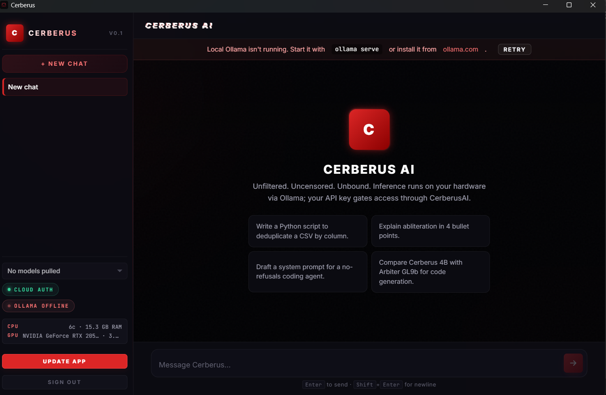

# Cerberus AI — Local-First Chat Dashboard



Cerberus is a powerful, local-first chat dashboard designed for uncensored and private interactions with language models. It runs entirely on your machine via Ollama, ensuring your data never leaves your local environment.

> [!IMPORTANT]
> **API Key Required:** An active API key from [cerberusai.dev](https://cerberusai.dev) is **REQUIRED** to utilize this software and unlock the chat interface.

## Features

- **Local-First Privacy**: Your chats and data stay on your machine.
- **Uncensored Models**: Full support for uncensored language models without restrictions.
- **LM Studio-Style Model Picker** *(New in v0.1.3)*: Dropdown shows all allowlisted models with download status. Selecting an undownloaded model auto-triggers the pull.
- **Download Progress Bar** *(New in v0.1.3)*: Fixed top-of-window progress bar during model downloads with real-time percentage and status.
- **Smart Update Button** *(New in v0.1.3)*: Shows current version, checks GitHub for updates, pulses when a new version is available.
- **Server-Driven Model Allowlist** *(New in v0.1.3)*: Model filtering driven by the API instead of hardcoded names.
- **Dynamic Quantization**: Automatically selects and downloads the smallest available quantization for any given model.
- **Direct-GGUF Flow**: Blazingly fast model pulls directly from our high-speed mirrors.
- **Modern UI**: Sleek, glassmorphic design built with Vue 3 and Tauri.

## One-Line Install (Windows)

```powershell
irm https://cerberusai.dev/get | iex
```

Or download the latest installer from our [releases page](https://github.com/tjcrims0nx/CerberusAI-Desktop/releases).

## Getting Started

1. **Install Ollama**: Ensure [Ollama](https://ollama.com) is installed and running on your machine.
2. **Get an API Key**: Sign up at [cerberusai.dev](https://cerberusai.dev) to obtain your unique API key.
3. **Download Cerberus**: Run the one-liner above or grab the installer from [releases](https://github.com/tjcrims0nx/CerberusAI-Desktop/releases).
4. **Unlock and Chat**: Enter your API key in the app and start chatting locally!

## Development

Cerberus is built using:
- **Frontend**: Vue 3, Vite
- **Backend**: Rust, Tauri
- **Models**: GGUF via Ollama

To run locally for development:
```bash
npm install
npm run dev
```

To build for production:
```bash
npm run tauri build
```
