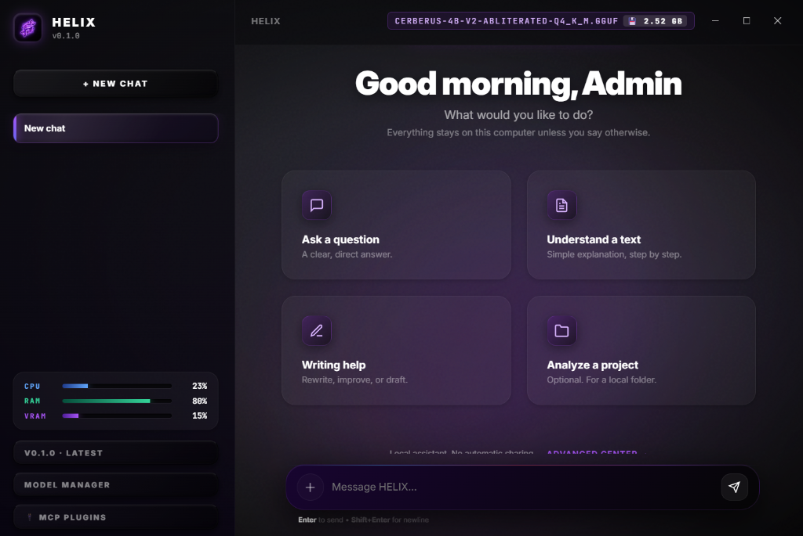
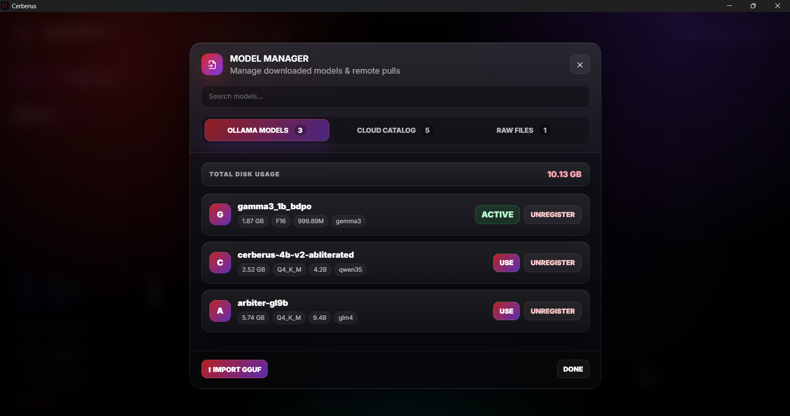
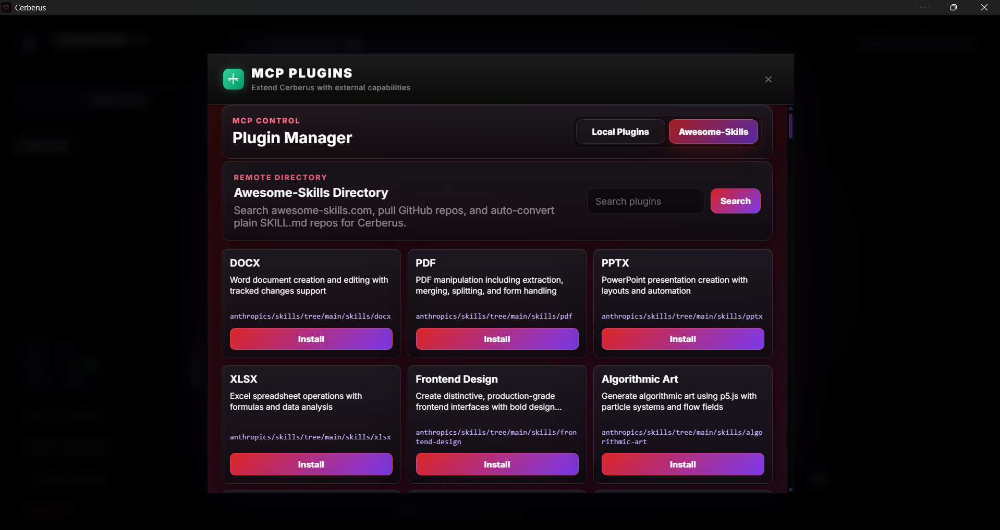

# Cerberus AI Desktop

Local-first AI chat for CerberusAI models, built with Tauri, Rust, Vue, and Ollama.



Cerberus runs a private desktop chat surface on your machine, streams through local Ollama models, and uses your CerberusAI API key for gated access, model catalog features, and account-backed services.

> [!IMPORTANT]
> An active API key from [cerberusai.dev](https://cerberusai.dev) is required to unlock the desktop app.

## Latest Stable

- **Current stable:** [v0.4.1](https://github.com/tjcrims0nx/CerberusAI-Desktop/releases/tag/v0.4.1)
- **NSIS installer:** `Cerberus-Setup.exe`
- **MSI installer:** `Cerberus_0.4.1_x64_en-US.msi`
- **Checksums:** included in `SHA256SUMS.txt`

The public website release block on [cerberusai.dev](https://cerberusai.dev) is updated automatically when a new stable GitHub Release is published.

## Install

Run this in Windows PowerShell:

```powershell
irm https://cerberusai.dev/get | iex
```

Or download manually from the [GitHub Releases page](https://github.com/tjcrims0nx/CerberusAI-Desktop/releases).

The installer flow bootstraps the pieces Cerberus needs, including WebView2, Ollama, and the desktop app.

## What Is New

- **v0.4.1 desktop refresh:** updated dark Cerberus interface, model status, and local chat shell.
- **Model Manager:** manage local Ollama models, remote catalog pulls, raw GGUF imports, active model selection, and disk usage.
- **MCP Plugins:** browse and install local plugins or remote awesome-skills entries from inside the app.
- **Stable release automation:** stable GitHub Releases update Discord changelog posts and refresh the website release summary automatically.
- **Sitewide branding:** homepage preview, logo, favicon, Apple touch icon, and social link-preview images now use the refreshed Cerberus assets.

## Screenshots

### Chat Dashboard


### Model Manager



### MCP Plugin Manager



## Features

### Local-First Chat

- Runs as a native desktop app with a Tauri shell.
- Streams responses from local Ollama models.
- Keeps chat interaction on your machine.
- Shows CPU, RAM, and VRAM activity in the interface.

### Model Management

- Local Ollama model registry.
- Cloud catalog for Cerberus-hosted models.
- Raw GGUF import flow.
- Active model switching.
- Disk usage summary.
- Model metadata for size, quantization, family, and status.

### MCP Plugins And Skills

- Built-in plugin manager.
- Local plugin browsing.
- Remote awesome-skills discovery.
- One-click install flow for supported skill entries.
- Search-driven plugin discovery.

### Downloads And Updates

- Stable one-line installer.
- GitHub Release installers and checksums.
- Smart version display in the app.
- Release workflow publishes stable builds and updates external surfaces.

## Getting Started

1. Install Cerberus with the PowerShell one-liner.
2. Sign up at [cerberusai.dev](https://cerberusai.dev).
3. Copy your API key from the dashboard.
4. Launch Cerberus and paste the key.
5. Pick or download a model from the Model Manager.
6. Start chatting locally.

## Development

```bash
npm install
npm run tauri dev
```

Build a production desktop app:

```bash
npm run tauri build
```

## Stack

- **Frontend:** Vue 3, Vite
- **Desktop:** Tauri
- **Backend:** Rust
- **Models:** Ollama and GGUF
- **Release hosting:** GitHub Releases
- **Website:** [cerberusai.dev](https://cerberusai.dev)

## Release Notes

Stable releases are published at:

[github.com/tjcrims0nx/CerberusAI-Desktop/releases](https://github.com/tjcrims0nx/CerberusAI-Desktop/releases)

Prerelease builds may exist for testing, but production website and Discord changelog automation is wired to stable releases only.
