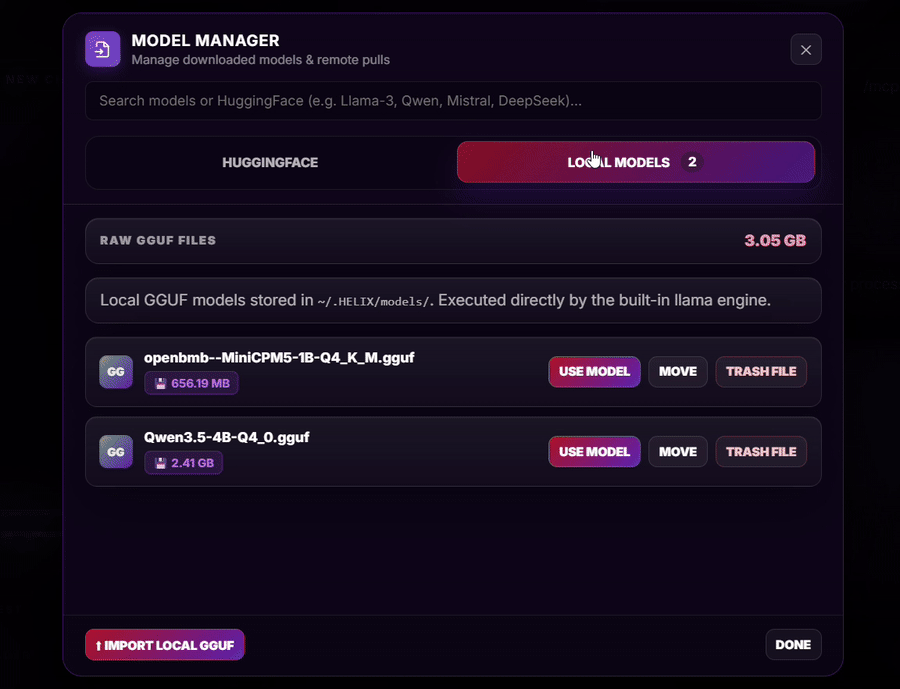
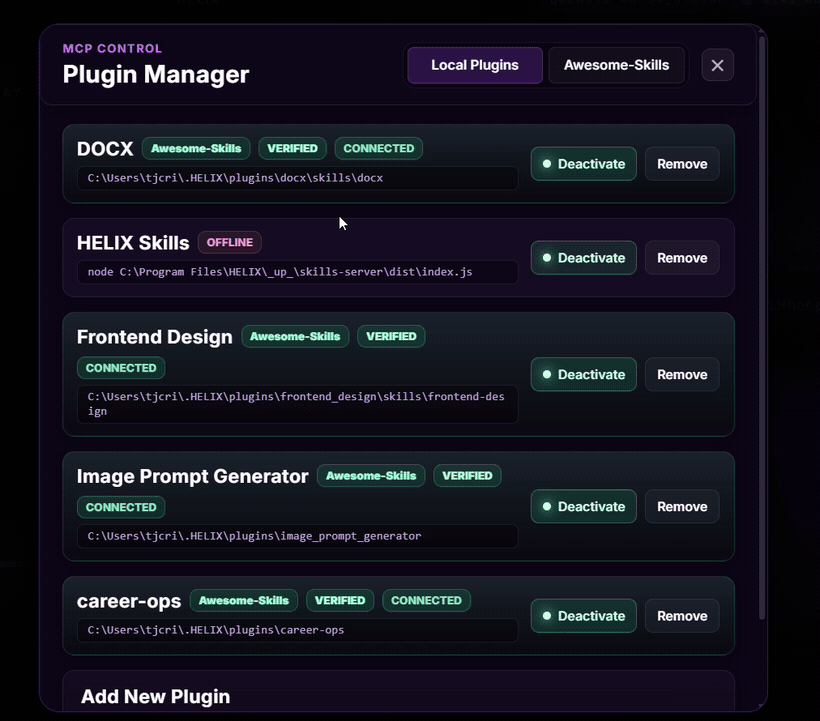

# HELIX Desktop (v0.6.11)

Local-first, 100% private desktop AI chat shell built with Tauri 2, Rust, Vue 3, and native `llama.cpp` engine.

HELIX provides a standalone, private desktop chat environment. Run local GGUF models directly on your hardware without needing external cloud services, API keys, or third-party background daemons.

> [!NOTE]
> **Release Notice**: HELIX Desktop v0.6.11 is the latest stable release. If you encounter any bugs or feature requests, please report them on the [GitHub Issues Page](https://github.com/tjcrims0nx/Helix/issues).

---

## ⚡ What's New in v0.6.11

- **🧠 Very Large Context Windows**:
  - The engine no longer runs at a fixed 8192 tokens, so attaching a sizeable file stops failing with *"request exceeds the available context size"*. It negotiates the largest window your machine can actually serve — 131072 → 65536 → 32768 → 8192 — trying full GPU offload, then weights-on-GPU with the KV cache in system RAM, then CPU.
  - On a 4 GB GPU that reaches **131072 tokens with every layer still on the GPU**. The K cache is quantized to `q8_0` to halve its size, and `llama-server` flags are probed from `--help` rather than assumed, so older and newer engine builds both work.
  - The Ollama path, which cannot negotiate, was raised from 2048 to 32768.

- **⬇️ In-App Update Now Installs**:
  - The updater downloaded the installer and then opened a browser instead of installing. It now launches the installer elevated through UAC, which is what a `perMachine` NSIS bundle requires.
  - It also picks the right asset (the NSIS installer, whatever the upload order), deletes a partial download instead of launching it, catches a truncated transfer, and stops the engine before exiting so nothing holds a lock on `~/.HELIX/bin`.

- **📎 File Attachments Shown as Pills**:
  - An attached text file no longer dumps its entire body into the chat bubble. It appears as a pill with its name, line count and size; click to unfold the contents. The model still receives the full text.
  - A message with only files attached and no typed text can now be sent, and titles the chat from the file names.

- **🔄 Model Manager Refresh**:
  - A refresh button in the manager header re-scans for models without reopening the window, and re-runs the HuggingFace query when that tab is active.

- **🔌 MCP Plugin Loading Fixes**:
  - Stdio servers are launched by a plain absolute path, fixing `EISDIR: illegal operation on a directory, lstat 'C:'` — a Windows extended-length path that Node could not load, which took the HELIX Skills server offline.
  - Plugin installs now initialise git submodules, so a plugin whose skills live in one (such as `ai_maestro`) installs with its skills instead of an empty directory.

- **📥 Non-Destructive `.gguf` Import**:
  - Importing a local `.gguf` now **copies** it into `~/.HELIX/models/` and always leaves your original file exactly where it was.
  - A failed or truncated copy is rolled back instead of leaving a partial file behind, and a same-named different model lands as `name-2.gguf` rather than overwriting.
  - `.GGUF` is accepted alongside `.gguf`.

- **🔗 Ollama Is Now Optional, Not Required**:
  - Ollama registration is best-effort: if the CLI is missing or the daemon is asleep, the import still succeeds and reports why registration was skipped. The model runs on HELIX's built-in `llama-server` engine either way.
  - Temporary `Modelfile`s are written outside the models folder and cleaned up even on failure; stray ones left by earlier versions are swept on the next import, and deleting a model removes its sibling `.Modelfile`.

- **🔌 MCP Plugin Install & Repair**:
  - Nested `.mcp.json` files are detected when installing a plugin, so servers that ship their config in a subdirectory no longer come up **Offline**.
  - `${CLAUDE_PLUGIN_ROOT}` is expanded in imported `.mcp.json` configs, and already-installed plugins are auto-repaired on load.

- **🛡️ Process Lifecycle & OS Error 32 Resolution**:
  - Bound `llama-server.exe` to Tauri `RunEvent::Exit` lifecycle hooks so background engine processes exit cleanly when closing HELIX.
  - Implemented orphan process cleanup (`kill_orphan_llama_servers`) and a handle-release delay on Windows to eliminate file lock errors (`os error 32`) during app restarts.
  - Hardened MCP bridge subprocess stream extractions against backend thread panics.

- **🎨 Model Manager & HuggingFace UI Enhancements**:
  - Compacted card layout with dynamic grid column sizing (`minmax(185px, 1fr)`) preventing card bleeding off the right border.
  - Fixed action button clipping on HuggingFace repository rows (`VIEW FILES ▼` / `HIDE FILES ▲`).
  - Added horizontal scroll support (`overflow-x: auto`) and word-wrapping (`overflow-wrap: anywhere`) so long GGUF model names and quant tags remain fully visible.

- **💻 Professional Code & File Creation**:
  - Auto-generated language tags (`PYTHON`, `TYPESCRIPT`, `RUST`, `HTML`, `CSS`, `VUE`, `JSON`, `POWERSHELL`, `SQL`, `BASH`) and file extension suggestions.
  - One-click **Copy** button on code blocks with animated feedback (`Copied ✓`).
  - One-click **Download / Save File** button prompting native Windows File Save Dialog via Tauri (`save_text_file`).

- **🔌 In-Chat `/mcp` Slash Commands & Composer Menu**:
  - `/mcp list`: Live status overview of all configured MCP plugins, connection state (🟢 Connected / 🔴 Offline), and endpoints.
  - `/mcp enable <id>` & `/mcp disable <id>`: Activate or deactivate plugins directly inside chat prompts.
  - `/mcp open`: Instantly open the Plugin Manager modal.

- **🌐 Dual Stdio & SSE MCP Plugin Support**:
  - Command-based (`stdio`) and URL-based (`SSE`) MCP plugin forms with live toggle tabs in the Plugin Manager.
  - Real-time **Connected / Offline** status badges linked directly to active sidecar processes.

- **⚡ Standalone Native `llama-server` Engine**:
  - Built-in `llama.cpp` integration with Vulkan GPU acceleration and FlashAttention (`-fa auto`) for fast prompt processing.

- **📦 HuggingFace GGUF Search & Parallel Chunk Downloads**:
  - Direct search for open-source GGUF models on HuggingFace.
  - Multi-threaded 8-stream parallel downloads with resume support and accurate file size metadata.

---

## 📦 Latest Stable Release

- **Current Stable:** [v0.6.11](https://github.com/tjcrims0nx/Helix/releases/tag/v0.6.11)
- **Windows Installer (NSIS):** [`HELIX-Setup.exe`](https://github.com/tjcrims0nx/Helix/releases/download/v0.6.11/HELIX-Setup.exe)
- **Windows Installer (MSI):** [`HELIX_0.6.11_x64_en-US.msi`](https://github.com/tjcrims0nx/Helix/releases/download/v0.6.11/HELIX_0.6.11_x64_en-US.msi)
- **Checksums:** [`SHA256SUMS.txt`](https://github.com/tjcrims0nx/Helix/releases/download/v0.6.11/SHA256SUMS.txt)

---

## 📥 Installation

### Download & Install

Download the latest installer ([`HELIX-Setup.exe`](https://github.com/tjcrims0nx/Helix/releases/download/v0.6.11/HELIX-Setup.exe) or [`HELIX_0.6.11_x64_en-US.msi`](https://github.com/tjcrims0nx/Helix/releases/download/v0.6.11/HELIX_0.6.11_x64_en-US.msi)) directly from the [GitHub Releases page](https://github.com/tjcrims0nx/Helix/releases/latest).

---

## 🖼️ Interface Showcase

### Chat Dashboard


### Model Manager & HuggingFace Pulls


### MCP Plugin Manager


---

## ✨ Core Features

### 🖥️ 100% Local & Private
- Native desktop shell powered by Rust & Tauri 2.
- Direct execution via built-in `llama-server` engine.
- Hardware monitoring displaying real-time CPU, RAM, and VRAM usage.
- All prompts, chats, and models stay 100% on your machine.

### 📦 GGUF Model Management
- Browse & search HuggingFace open-source GGUF models.
- Parallel multi-threaded chunked downloads with resume support.
- One-click import for custom local `.gguf` files — non-destructive, your original file stays where it is.
- Active model switching and real-time disk usage analytics.

### 🔌 Model Context Protocol (MCP)
- Built-in MCP Plugin Manager supporting stdio binaries & SSE URLs.
- In-chat `/mcp` slash commands for instant plugin management.
- Connect filesystem tools, Web APIs, and custom agent skills.
- Automatic tool calling loop with reasoning trace.

#### 🚀 How to Activate & Manage MCP Plugins

1. **Activating Built-in HELIX Skills**:
   - Open the **Plugin Manager** by clicking **MCP Plugins** in the sidebar or entering `/mcp open` in chat.
   - Locate the pre-configured **HELIX Skills** card (bundled MCP server providing local file manipulation and tool execution).
   - Click **Activate** (toggle power button). The status badge will turn 🟢 **Connected**.

2. **In-Chat `/mcp` Slash Commands**:
   - `/mcp list`: View all configured plugins and connection status.
   - `/mcp enable <name|id>`: Activate an MCP plugin directly in chat (e.g., `/mcp enable helix-skills`).
   - `/mcp disable <name|id>`: Deactivate an active MCP plugin.
   - `/mcp open`: Instantly open the MCP Plugin Manager UI.

3. **Adding Custom MCP Servers**:
   - **Command (stdio)**: Add local executable/script servers (e.g. `npx`, `python`) with custom CLI arguments.
   - **URL (SSE)**: Connect to remote Server-Sent Events endpoints (e.g., `https://example.com/mcp/sse`).
   - **Config Import**: Load existing configuration files by providing the path to a `.mcp.json` file.
   - **Awesome-Skills Directory**: Search and install community skills from `awesome-skills.com` under the **Awesome-Skills** tab.

---

## 💻 Development

### Prerequisites
- Node.js (v18+)
- Rust (v1.77+)
- Tauri CLI (`npm install -g @tauri-apps/cli`)

### Run Locally

```bash
# Install dependencies
npm install

# Launch app in development mode
npm run tauri:dev
```

### Production Build

```bash
# Build desktop installer executable
npm run tauri:build
```

---

## 🛠️ Technology Stack

- **Desktop Framework**: Tauri 2 (Rust)
- **Frontend Logic**: Vue 3, Vite, TypeScript
- **Local Engine**: `llama-server` (Vulkan GPU offload + FlashAttention)
- **Design System**: Windows 11 Fluent Glassmorphism (CSS Tokens)
- **Distribution**: GitHub Releases & Actions Automation

---

## 📜 License & Releases

Stable releases and changelogs are published automatically at:
[github.com/tjcrims0nx/Helix/releases](https://github.com/tjcrims0nx/Helix/releases)
